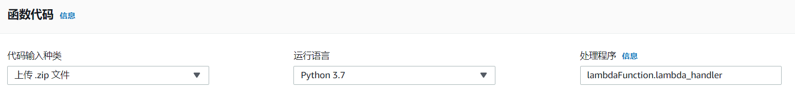

# AlexaToWealthbot
This repository aims to using Alexa to finish whole process in wealthbot.io. Since [eefelix](https://github.com/eefelix) used django to convert original [wealthbot.io](https://github.com/wealthbot-io/wealthbot) into new [wealthbot](http://ec2-54-173-235-225.compute-1.amazonaws.com) and setuped at aws ec2 machine, we used web scrapying method in lambda function to help us finish whole process in wealthbot by talking with Alexa. :grinning:

------

**If you find this code or this tutorial useful, would you please star this github project.**

# Upload files into AWS Lambda
Supposed that you are familiar to Alexa and lambda function, you may git this repository into your laptop firstly.

> git clone https://github.com/thompsonhu/AlexaToWealthbot.git

Next, you compress all files except `Demo` and 'alexa_index' into `request.zip` and upload into AWS Lambda. You need to check your process name called `lambdaFunction.lambda_handler`.

# Copy `alexa_index` file into your json editor in Alexa
After uploading all important files into your AWS lambda, you also need to copy all code in `alexa_index` into your json editor. Endpoint setting is also important to you. :collision:

# Now, use Test to talk with Alexa! :satisfied:
You can talk with Alexa in Test part now and you also can refer to `Demo` file which contains sentences that we used to communicate with Alexa.

# TODO
------
- [x] alexa json file
- [x] basic function (change information in Alexa into correct format for weathbot)
- [x] upload request module in AWS Lambda
- [ ] lambda function
- [ ] request function (For web scapying)