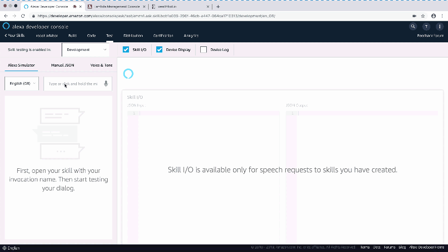
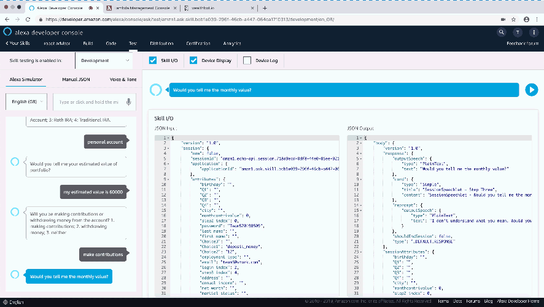

# AlexaToWealthbot
This repository aims to using Alexa to finish whole process in wealthbot.io. Since [eefelix](https://github.com/eefelix) used django to convert original [wealthbot.io](https://github.com/wealthbot-io/wealthbot) into new [wealthbot](http://ec2-54-173-235-225.compute-1.amazonaws.com) and setuped at aws ec2 machine, we used web scrapying method in lambda function to help us finish whole process in wealthbot by talking with Alexa. :grinning:

------

**If you find this repo useful, would you please star this github project. :thumbsup:**

# Upload files into AWS Lambda
Supposed that you are familiar to Alexa and lambda function, you may git this repository into your laptop firstly.

> git clone https://github.com/thompsonhu/AlexaToWealthbot.git

Next, you compress all files except `Demo` and 'alexa_index' into `request.zip` and upload into AWS Lambda. You need to check your process name called `lambdaFunction.lambda_handler`.


# Set Alexa intent and slot
After uploading all important files into your AWS lambda, you also need to copy all code in `alexa_index` into your json editor. Endpoint setting is also important to you. :collision:

# Now, use Test to talk with Alexa!
You can talk with Alexa in Test part now :satisfied: and you also can refer to `Demo` file which contains sentences that we used to communicate with Alexa.

Open Robot Advisor         |  Get Portfolio
:-------------------------:|:-------------------------:
          |  

You can open this alexa skill and try to register an account in wealthbot like this:
```
User: open robot advisor
Alexa: Welcome to Robot Advisor! It's my pleasure to meet you! 
        Would you want to register or log in?
User: register
...
```

# TODO
------
- [x] alexa json file
- [x] basic function (change information in Alexa into correct format for weathbot)
- [x] upload request module in AWS Lambda
- [x] request function (For web scapying)
- [x] lambda function

# Acknowledgement
This project is the final project of MAFS6010V in HKUST.

# Reference
[KeithGalli. Alexa-Python](https://github.com/KeithGalli/Alexa-Python/blob/master/final_lambda_code.py)